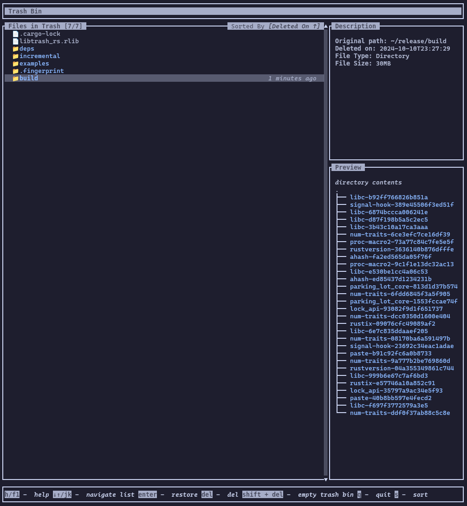
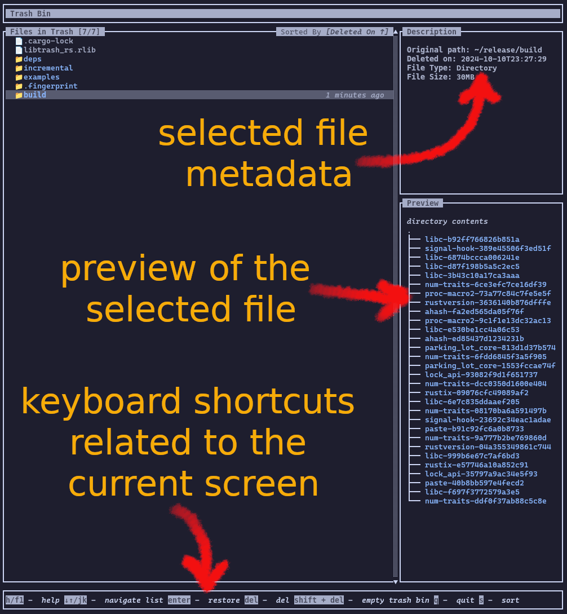
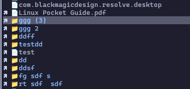

# freedesktop.org Trash Spec Implementation for the CLI

This is a [freedesktop.org Trash
Spec (v1.0)](https://specifications.freedesktop.org/trash-spec/) implementation
written in Rust for the CLI. It has two binaries, `trash` for trashing files,
and `restore` for a TUI for browsing and managing trashed files. These two
binaires are independent, meaning they can work without the other present (ex: you
can restore a file trashed using another implementation).

The full specification is implemented, including `directorysizes` section which
is sometimes ignored by desktop environment implementations.



> DISCLAIMER: This is still in alpha testing stage. Please refer to the
> [Disclaimer of Warranty section of the Apache License v2.0](https://www.apache.org/licenses/LICENSE-2.0) 
> for more information on the liabilities taken on by the developer(s).
> In short, the user assumes all risks of using this software.

## Installation

### Binaries
Download the signed binaries from the [Releases
page](https://github.com/chamilad/trash-rs/releases) and move it to somewhere
under the `$PATH` lookup.

### Compile
#### Prerequisites
1. Rust (with cargo) and `x86_64-unknown-linux-gnu` toolchain
1. [GNU `make`](https://www.gnu.org/software/make/)

Clone this repository and run `make all` to build the two binaries. The
resulting binaries are in `./target/release/`.

## Trashing files

Use `trash` to trash files. `trash` tries to implement the same arguments as
coreutils `rm`, but it is not a drop in replacement for `rm`.

```bash
$ trash -h

trash version local
a freedesktop.org trash spec implementation for the CLI

Usage: trash [OPTION]... [FILE]...
Move the FILE(s) to the trash bin without unlinking

    -h, --help          display this help and exit
    -i, --interactive   prompt before every move
    -v, --verbose       explain what is being done
    -V, --version       output version information and exit

trash does not traverse symbolic links. It will only move the link to
trash bin, not the target.

To trash a file whose name starts with a '-', for example '-foo',
use one of these commands:
  trash -- -foo

  trash ./-foo

To restore a trashed file, any freedesktop.org trash specificaiton compatible
tool can be used, including File Explorer in desktop environments like GNOME or
the TUI released with this project, \"Trash Bin\".

trash source code, documentation, and issue tracker is in Github:
<https://github.com/chamilad/trash-rs>


$ trash somefile.txt
```

## Managing Trash Bin

Use `restore`. `restore` is a TUI (Text User Interface) written using the
awesome [`ratatui`](https://github.com/ratatui) framework to provide an
explorer like interface to manage trashed files including the following
actions.

1. Restore trashed files
1. Delete a single file
1. Empty entire trash bin

Press `h` or `F1` for the keyboard shortcuts that can be used to navigate the
UI and perform actions.

```bash
restore
```



You can sort the file list by,
1. Deletion Date (default) - latest on top
1. Original Path
1. File Size - largest on top
1. File Name - A-Z

### Themes
There is limited Dark and Light theme variation in the `restore` UI. It
defaults to the `DARK` theme, but if you are using a light terminal theme,
`DARK` colours will not look good. In that case, switch to `LIGHT` theme by
setting the environment variable `TRASH_RS_THEME` in your shell. Usually, it
will help if this can be permanently set in your shell configuration script
like `$HOME/.bashrc` or `$HOME/.zshrc`.

```bash
export TRASH_RS_THEME=LIGHT
```


## Highlevel Implementation Details
The Trash Directories used are defined in the
[specification](https://specifications.freedesktop.org/trash-spec/latest/#trash-directories).

The specification does not enforce moving files from external mounts to home
mount trash, and this implementation elects not to do that.

> The implementation MAY also support trashing files from the rest of the
> system (including other partitions, shared network resources, and removable
> devices) into the “home trash” directory.

Similary, if external mount "top directories" are not available for trashing,
this implementation elects not to trash the file at all.

> If both (1) and (2) fail (that is, no $topdir/.Trash directory exists, and 
> an attempt to create $topdir/.Trash-$uid fails), the implementation MUST 
> either trash the file into the user's “home trash” or refuse to trash it.

The `restore` UI shows trashed files from "top directories" with an icon to
indicate an "external mount".

> If an implementation does NOT provide trashing in top directories, and does
> provide the user with some interface to view and/or undelete trashed files,
> it SHOULD make a “best effort” to show files trashed in top directories (by
> both methods) to the user, among other trashed files or in a clearly
> accessible separate way.



### Details unrelated to the spec
1. This implementation does not traverse symbolic links, i.e. trashing a
   symbolic link only moves the link, **NOT the target**, to the trash bin. In
   the future, this could be configurable through a command line argument. This
   default behaviour is decided to be similar to coreutils `rm` behaviour where
   `rm <link>` unlinks the link, and does not delete the target.

## License
The source code and the release artifacts are licensed under 
[Apache License v2](https://www.apache.org/licenses/LICENSE-2.0)

## Support and Contributing
This software is provided with absolutely no promise of support, I'm a beginner
in Rust, and this was a pet project. Having said that, I'll probably be able to
tend to any issues that you can report on the "Issues" tab. Pull Requests
fixing bugs you find are also welcome!!
